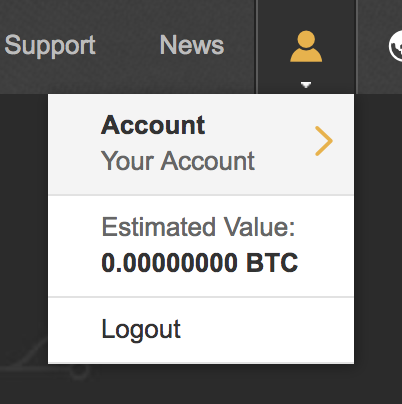
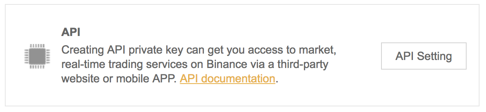
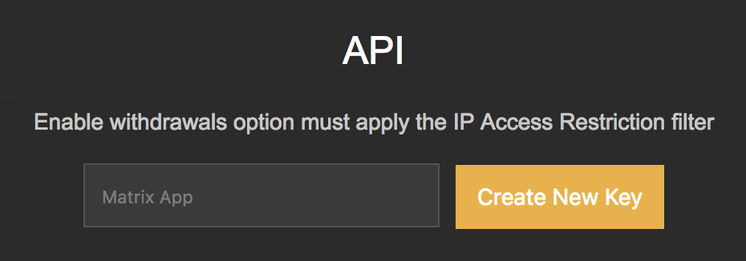
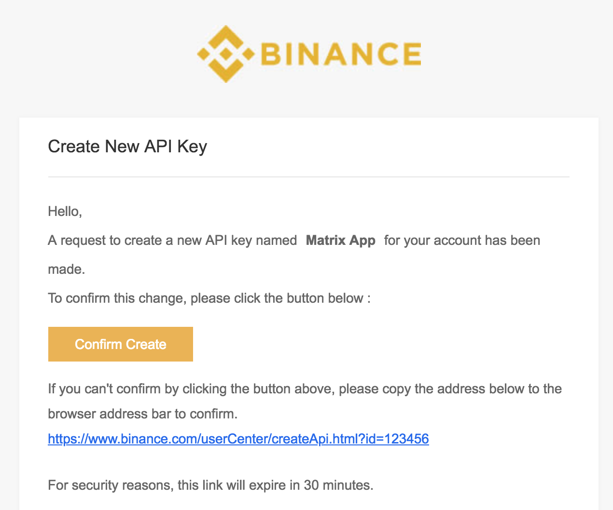
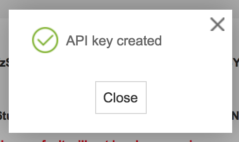
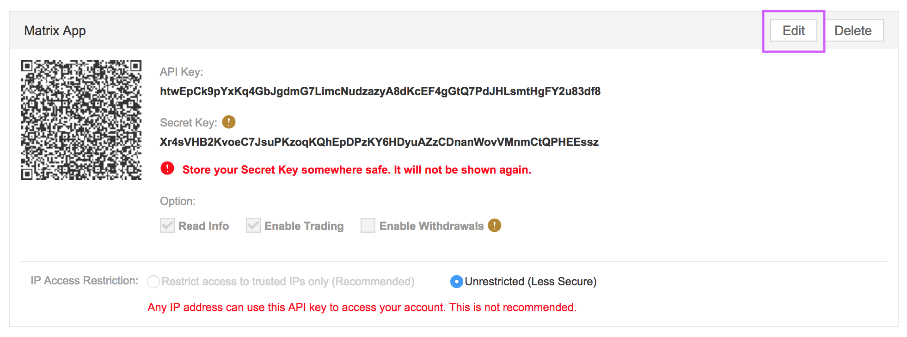
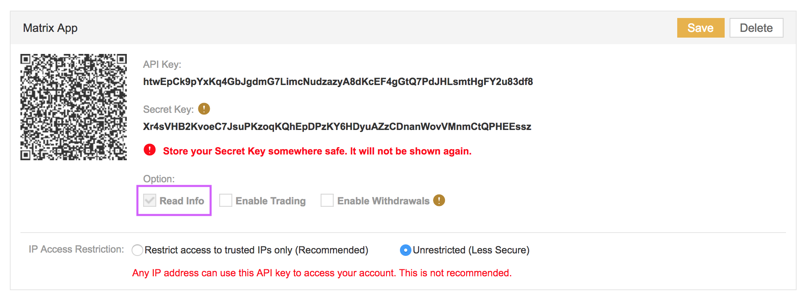

1. Login to your Binance.com account, and go to your **Account Settings** Page:

2. Find and click on **API Settings**:

3. At the top of the API settings page, enter Matrix App (or whatever name you prefer), and click **“Create New Key”**:

4. Binance will then send you an email for verification, simply click **“Confirm Create”** in the email you receive:

5. It’ll bring you back to Binance, and you’ll see that a popup appears saying an API key is created:

6. Close the popup, and **scan the QR code** with the Matrix Portfolio app. *Alternatively*, you can copy and paste the **API Key** and the **Secret Key** into Matrix Portfolio manually.

6. Click **“Edit”**, and make sure you  **ONLY enable “Read Info” access**, then click **“Save”**.

8. And you’re done!

