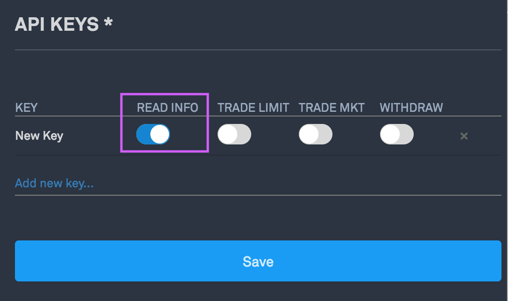

1. Login to your Bittrex.com account, and go to your **Settings** page:

2. In the Settings menu, click **API Keys**:

3. Click **“Add New Key”**, and **ONLY ENABLE “READ ONLY” ACCESS**:

4. Click **“Save”**, then copy the API Key and Secret Key into Matrix Portfolio:

5. And you’re done!
