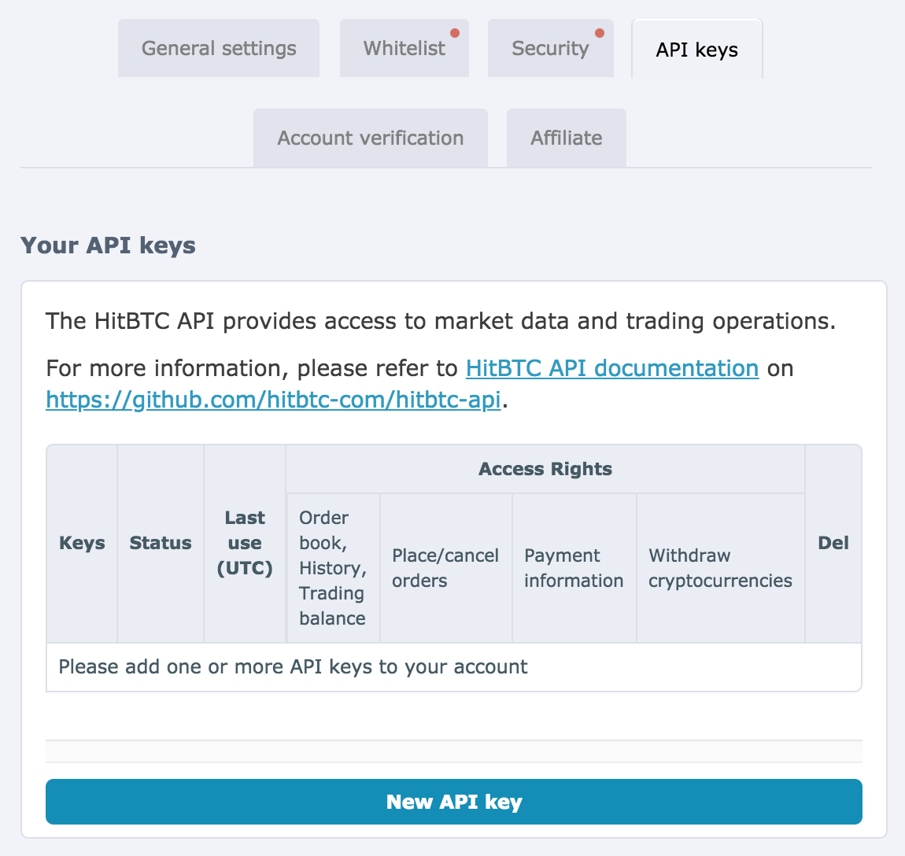
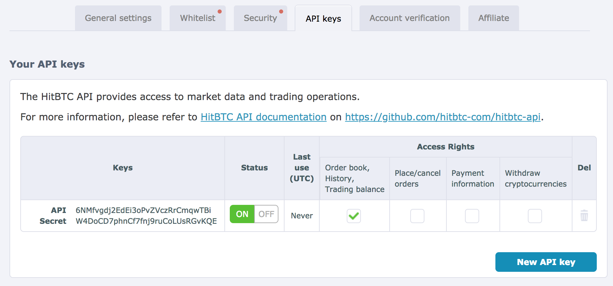

1. Login to your HitBTC.com account, then go to **Settings**, and then the **API Keys tab**:

2. Click **New API Key**, and **MAKE SURE YOU ONLY ALLOW READ ACCESS**, then copy and paste the **API** and **Secret** into Matrix Portfolio:

3. And you're done!
