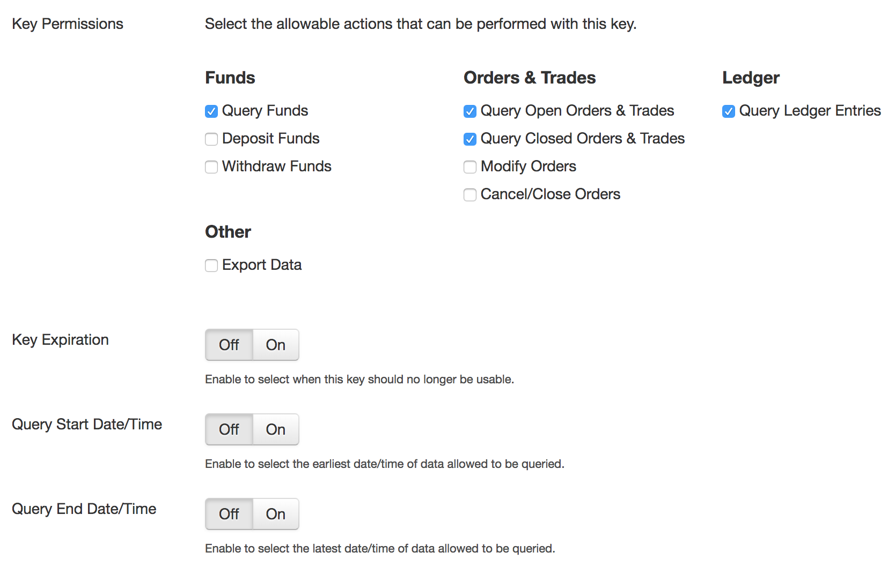

1. Login to your Kraken.com account, then go to **Settings**, and then the **API section**:

2. Scan the QR code, or manually enter the **API Key** and **Secret** into Matrix Portfolio:

3. **IMPORTANT: Make sure your settings only allow QUERY ACCESS ONLY**, and **ALL OTHER SETTINGS ARE SET TO OFF**:

4. Click **"Save"** And you're done!
